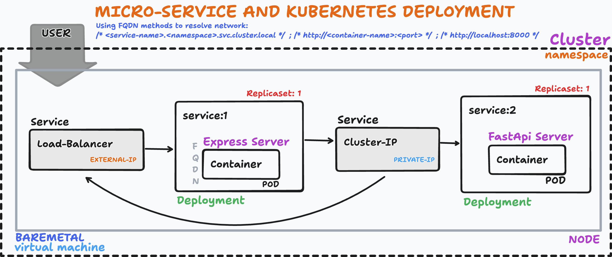
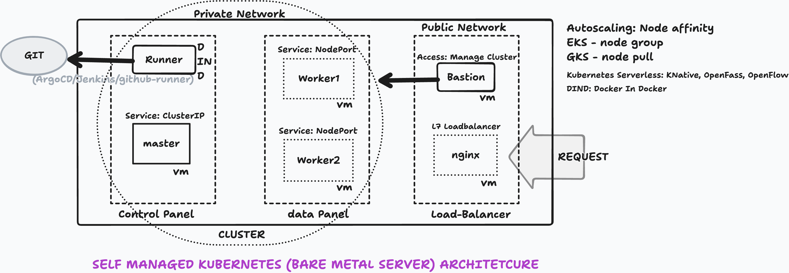
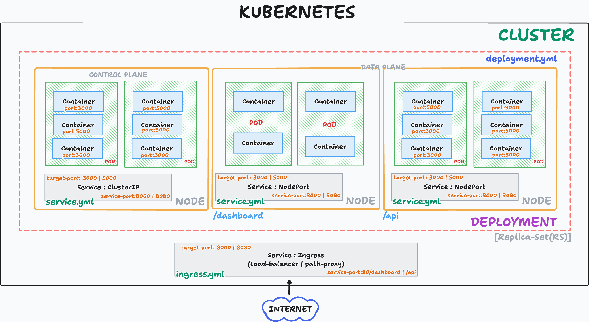

# Service Architechture

* Sequence and steps of build an microservice from baremental server to kubernetes way 
```
Local -> Docker -> Docker Compose -> kind/minikube/kubeadm/k3s
```



## Kubernetes Hands-on Commands and Steps
```
# check docker
sudo dockerd > /tmp/dockerd.log 2>&1 &
docker info

# create your Kubernetes cluster:
kind create cluster --name learning

# Check the cluster:
kubectl cluster-info
kubectl get nodes

# Deploy: 
kubectl apply -f kubernetes/nginx.yaml

# Constantly used commands:
kubectl get deployments
kubectl get pods
kubectl get services
kubectl get all

# Inspect a pod:
kubectl describe pod <pod-name>

# View logs:
kubectl logs <pod-name>

Watch pods:
kubectl get pods -w

Scale Nginx:
kubectl scale deployment nginx --replicas=5


# local testing (Port-forward):
kubectl port-forward service/nginx-service 8080:80

# open/vist:
http://localhost:8080

remove everything:
kubectl delete -f kubernetes/nginx.yaml
kind delete cluster --name learning
```

### Self Managed Kubertnetes Design Architecture




## Why Kubernates

```
Complexity to solve when application growing:

* Network Complexity (port limitation)
* Deployment Complexity (down time, reliability issue)
* Application Complexity (recovery issue)
* Container management tool (orchestrator)
* Micro-Service or distributed system implementation
* High availability and scaling 
```

```
Entities of Kubernete (Objects/Components):

* Pod -> collections of containers
    * lowest form of entity

* Deployment -> manages pods | collection of pods
    * at least 2 pods in one scripts

* Node -> every number of server

* Control plane -> particular node to handle other nodes

* Cluster -> collections of nodes

* Service -> manages containers for access (3 types)
    * ClusterIP -> port forwarding (container port)
        * private network - privately access

    * Nodeport -> port forwarding (multiple port)
        * outer world - public access

    * Ingress/Loadbalancer -> path proxy single port (load-balancer)
        * given access to cluster all containers with a single port
        * public access with path
        * Not used in on-premises, only used in cloud
```

### Components View of Kubernetes 



```
!!! Resources 

Minicude Commands: https://minikube.sigs.k8s.io/docs/start/?arch=%2Fmacos%2Farm64%2Fstable%2Fbinary+download

Kubectl Commands: https://kubernetes.io/docs/reference/generated/kubectl/kubectl-commands

Book(kubernetes in Action): https://sutlib2.sut.ac.th/sut_contents/H173702.pdf
```